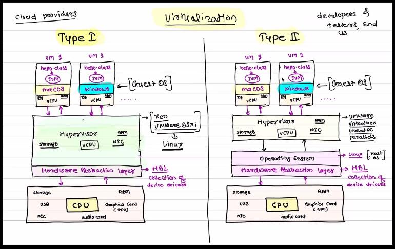

# CLoud COmputing 

## Syllabus 

1.  Introduction to Cloud,
2.  Introduction to 
- Virtualization,
- Containerisation ,
- Cloud Computing,
-  Cloud SPI Model,
-   Cloud Computing Types,
-    Cloud Security,
-   Virtualization, 
-   Hardware Virtualization,
-   Para-Virtualization,
-   Cloning,
-   Snapshot and Template,Containerization,
-   Operating System Virtualization,
-   Cloud architecture,
-   Deployment models,Services provided by Cloud ,
-  Cloud development best practices,
-   Introduction to AWS


--- 

# Day1 

### notes

-  
1. **Desktop computing** 
- The first computer was invented by Charles Babbage (1822) but was not built until 1991! 
  - Alan Turing invented computer science.
  -  The ENIAC (1945) was the first electronic general-purpose digital computer, it filled a room.
  -   The Micral N was the world's first “personal computer”(1973).
- first type of computing(mostly 70's era super computer to desktop )


1. **Client- server computing** 
- 1. second type of computing (in 21 st century came client server ctype computing )
- 2. the internet came into being in 1983 
     - Vinton Cerf and Bob Kahn are credited with inventing the Internet communication protocols we use today and the system referred to as the Internet. 

1. **vertical scaling**  
-  scale up : by increasing server cpu configuration , like cpu processor, ram , storage 

- scale down : decreasing your cpu configuration due to decreased website traffic people visiting 

- issues with vertical scaling 
- 1. dependency on one machine
- 2. limit on single server cpu configuration 

3. **Cluster computing** 
- here we use horizontal scaling,so it is also called **distributed computing** 
- as requested are distributed between multiple machine 
1. **Horizontal scaling** 
- 1. due to issues with vertical scaling , we turn to horizontal scaling
1.we are  cloning server machine containing web server having the website ,this collection is called fleat of machines 
- this is known as CLuster computing 
- 2. here we need to connect fleet of machines to the client,
-  so we add Load Balancer to the cluster for handing request manqagement 
  - it check the free machine , and send the request to the clone  machine which can handle the request
  - example of load balancer :
     - **High Availability Proxy(HA Proxy)**
     - HAProxy is free, open source software that provides a high availability load balancer 
     - and proxy server for TCP and HTTP-based applications that spreads requests across multiple servers. 
     - It is written in C and has a reputation for being fast and efficient
     - using load balancer, we dont need public IP addresses for machines, it's a private address on the same network as the server

- 3. advantage of horizontal scaling  compared to vertical scaling : 
     - no dependency on single machine, comes with increased cost 
     - HIGH- AVAILABILITY 
        - even some clone machine fails, still website is working 

- 4. scaling out :adding more machines, increase in web request
- 5. scaling in : removing th machine , as decrease in web request


- 6. challenges with horizontal /distributed scaling
- need to physically adding machine. needed time for it , 
      - so problem not solved in real time 
- so to solve this , cloud computing was introduced


- 3. **scaling  and  problem with scaling  in client server computing** 
  
> https://www.geeksforgeeks.org/overview-of-scaling-vertical-and-horizontal-scaling/


4. **Cloud Computing**
-  
1. resources
- ppt on cloud
> https://www.journaldev.com/25061/cloud-computing

2. notes 
- 
1.  here the cluster/ fleat of machine are virtual machine server, and not physical server machine, based in a data center
2. in data center,
- 1.  there are server racks,
   -  where multiple  servers are located, with computing power, its located in one rack of server rack,so that rack is called rack server 
   -   with hard drive for storage ,where each HD has 128TB of SSD
   -   GPU + CPU + SSD + physical CPU  : these are componenet of Server rack

- 2. multiple server racks makeas a dat center 


5. **Virtualization** 
-

1.  act of creating a vitual version of something like virutal hardware platform,storage devices and computer network resources
- mostly virtual OS like linux,mac os,windows 
   - two type of hardware virtualization: 
   - 1. type I
   - 2. TYPE II
   - Containerization 


2.  as we needed to test application like java, on multiple os, like windows ,mac os, and linux 
- it was time consuming switching between OS, so virtualisation came into picture



1. TYPE II
+ 
1. Hardware
   - have CPU,NIC,GPU,Storage
2.  HAL (Hardware abstraction layer)
- collection of device driver
3. OS called Host OS
4. Hypervisor 
- convert physical version to virtual one
   - like virtual cpu (vcpu), ram, storage, NIC,
1. now on this hypervisor,
   -  we have virtual machine , here we can install an OS ,called guest OS
2. example of Hypervisor : 
   - virtual box
   - VMWare
   - vitual pc 
   - parallels 
3. for high PC hardware configuration, go for virtual OS, 
   - for lesser configuration ,use multi booting

4. Type I ,practical use 
-
1. easy to install and use , for personal computer,
  -  but we  cant use maximum configuration , due to physical OS on machine for UI , etc occupying resources  
2. best suited for developers,tester,and user   

---

5. TYPE I 
+
1. almost fullest configuration can be used here , as no physical OS i.e host OS om PC machine 
- here, they are customized OS, for virtualizing certian hardware ,and not include UI 
2. example of type I :

- 1. Xen 
    - Xen is an open-source type-1 or baremetal hypervisor,
    -  which makes it possible to run many instances of an operating system or indeed different operating systems in parallel on a single machine (or host).
 
- 2. VMWare esxi
    - VMware ESXi are hypervisors that use software to abstract
    -  processor, memory, storage and networking resources into multiple virtual machines (VMs).
    -   Each virtual machine runs its own operating system and applications.
  
3. best suited for cloud providers


# Day2 

1. to connect to ec2 instance

```bash
 > chmod 400 webserver.pem

> ssh -i webserver.pem ubantu@34.239.106.128

```
2.  after ec2 instance get connected, for single html page
```bash 
       sudo apt-get update
    2  sudo apt-get install apache2
    3  cd /var/www/html/
    4  sudo rm index.html
    5  sudo vim index.html
    6  history
    7 exit  


```


3. to deploy a angular application 
-
1. to connect to ec2 instance

```bash
 > chmod 400 webserver.pem

> ssh -i webserver.pem ubantu@34.239.106.128

```
2.  after ec2 instance get connected, 
```bash 
       sudo apt-get update
    2  sudo apt-get install mysql-server mysql-client
       
       sudo mysql

        alter user 'root'@'localhost' identified with mysql_native_password by 'manager';
Query OK, 0 rows affected (0.00 sec)

mysql> flush privileges;
Query OK, 0 rows affected (0.00 sec)

mysql> exit


sudo mysql -u root -p

create database sunbeam;


mysql> create table movie(movieId integer auto_increment primary key,name varchar(25),rating integer,description varchar(50),image varchar(150));
Query OK, 0 rows affected (0.01 sec)

mysql> exit

sudo apt-get install apache2

  service apache2 status

sudo apt-get install nodejs

sudo apt-get install unzip


packet_write_wait: Connection to 18.208.144.123 port 22: Broken pipe


-- make server folder a zip file 

 scp -i /home/sunbeam/dac/DevOps/Devops-module/Classwork/aws/suraj-aws.pem AMAZON-SERVER.zip ubuntu@18.208.144.123:~/
AMAZON-SERVER.zip  


```


## Questions 

1. What is cloud computing?
- Cloud computing is an internet based new age computer technology. 
- It is the next stage technology that uses the clouds to provide the services whenever and wherever the user need it.
- It provides a method to access several servers world wide.

2. What are the benefits of cloud computing?
- The main benefits of cloud computing are:
     + Data backup and storage of data.
     + Powerful server capabilities.
     + Incremented productivity.
     + Very cost effective and time saving.
     + Software as Service known as SaaS.
3. What is a cloud?
- A cloud is a combination of networks ,hardware, services, storage, and interfaces that helps in delivering computing as a service. It has three users :
     + End users
     + Business management users
     + cloud service provider
4. What are the different data types used in cloud computing?
- There are different data types in cloud computing like emails, contracts, images , blogs etc. As we know that data is increasing day by day so it is needed to new data types to store these new data. For an example, if you want to store video then you need a new data type.

5. Which are the different layers that define cloud architecture?
- Following are the different layers that are used by cloud architecture:
     + CLC or Cloud Controller
     + Walrus
     + Cluster Controller
     + SC or Storage Controller
     + NC or Node Controller
6. Which platforms are used for large scale cloud computing?
- The following platforms are used for large scale cloud computing:
     + Apache Hadoop
     + MapReduce
7. What are the different layers in cloud computing? Explain working of them.
- There are 3 layers in the hierarchy of cloud computing.
- 1. Infrastructure as a service (IaaS):
  - It provides cloud infrastructure in terms of hardware as like memory, processor, speed etc.
- 2. Platform as a service (PaaS):
  - It provides cloud application platform for the developer.
- 3. Software as a service (SaaS):
   - It provides the cloud applications to users directly without installing anything on the system. These applications remains on cloud.

8. What do you mean by software as a service?
- Software As a Service (SaaS) is an important layer of cloud computing.
-  It provides cloud applications like Google is doing.
-   It facilitate users to save their document on the cloud and create as well.

9. What is the platform as a service?
- It is also a layer in cloud architecture. This model is built on the infrastructure model and provide resources like computers, storage and network. 
- It is responsible to provide complete virtualization of the infrastructure layer, make it look like a single server and invisible for outside world.

10. What is on-demand functionality? How is it provided in cloud computing?
- Cloud computing provides a on-demand access to the virtualized IT resources. It can be used by the subscriber. It uses shared pool to provide configurable resources. Shared pool contains networks, servers, storage, applications and services.

11. What are the platforms used for large scale cloud computing?
- Apache Hadoop and MapReduce are the platforms use for large scale cloud computing.

12. What are the different models for deployment in cloud computing?
- These are the different deployment model in cloud computing:
     + Private cloud
     + Public cloud
     + Hybrid cloud
     + Community cloud

13. What is private cloud?
Private clouds are used to keep the strategic operations and other reasons secure.

14.  What is public cloud?
The public clouds are open to the people for use and deployment. For example: Google and Amazon etc. The public clouds focus on a few layers like cloud application, infrastructure providing and providing platform markets.


15.  What is the difference between scalability and elasticity?
- 1. Scalability is a characteristic of cloud computing which is used to handle the increasing workload by increasing in proportion amount of resource capacity. 
  - By the use of scalability, the architecture provides on demand resources if the requirement is being raised by the traffic.
- 2.  Whereas, Elasticity is a characteristic which provides the concept of commissioning and decommissioning of large amount of resource capacity dynamically.
  -  It is measured by the speed by which the resources are coming on demand and the usage of the resources.

18. What are the security benefits of cloud computing?
- Cloud computing authorizes the application service, so it is used in identity management.
- It provides permissions to the users so that they can control the access of another user who is entering into the cloud environment.

19. What is the usage of utility computing?
- Utility computing is a plug-in managed by an organization which decides what type of services has to be deployed from the cloud.
-  It facilitates users to pay only for what they use.

20. What is "EUCALYPTUS" in cloud computing? Why is it used?
- It is an acronym stands for
>  Elastic Utility Computing Architecture For Linking Your Program To Useful Systems. - It is an open source software infrastructure in cloud computing and used to implement clusters in cloud computing platform. 
> It creates public, private and hybrid cloud.
>  It facilitate a user to create his own data center into a private cloud and use its functionalities to many other organizations.


21.  What are the open source cloud computing platform databases?
- MongoDB, CouchDB, LucidDB are the example of open source cloud computing platform database.

22. Give some example of large cloud provider and databases?
     + Google bigtable
     + Amazon simpleDB
     + Cloud based SQL

23. What is the difference between cloud and traditional datacenters?
- The cost of the traditional datacenter is higher than cloud because in traditional databases, there is overheating problems and some software and hardware issue.


23.   Why API's is used in cloud services?
API's (Application Programming Interfaces) is used in cloud platform because:

It provide an alternative way that you don't need to write the fully fledged program.

It makes communication between one or more applications.

It creates applications and link the cloud services with other systems.

24.  What are the advantages of cloud services?
- Following are the main advantages of cloud services:

   + Cost saving: It helps in the utilization of investment in the corporate sector. So, it is cost saving.
   + Scalable and Robust: It helps in the developing scalable and robust applications. Previously, the scaling took months, but now, scaling takes less time.
   + Time saving: It helps in saving time in terms of deployment and maintenance.

28. What are the different datacenters in cloud computing?
   + Containerized datacenter
   + Low density datacenter
29. What do you mean by CaaS?
- CaaS is a terminology used in telecom industry as Communication As a Service. CaaS offers the enterprise user features such as desktop call control, unified messaging and desktop faxing.

30. What do you mean by VPN? What does it contain?
- VPN stands for Virtual Private Network. VPN is a private cloud that manage the security of the data during the communication in the cloud environment. 
- With VPN, you can make a public network as private network.

31. What are the basic clouds in cloud computing?
- There are three basic clouds in cloud computing:
   + Professional cloud
   + Personal cloud
   + Performance cloud
32. What are the most essential things that must be followed before going for cloud computing platform?
   + Compliance
   + Loss of data
   + Data storage
   + Business continuity
   + Uptime
   + Data integrity in cloud computing

33. What is the usage of virtualization platform in implementing cloud?
- The main usage of virtualization platform in implementing cloud is:
   +  It is used to manage the service level policies.
   +  Cloud Operating System.
   +  Virtualization platforms help to keep the backend level and user level concepts different from each other.
35. We source cloud computing platform databases?
- Following are the open source cloud computing platform databases:
    + MongoDB
    + CouchDB
    + LucidDB
36. What are some large cloud providers and databases?
- Following are the mostly used large cloud providers and databases:
   + Google bigtable
   + Amazon simpleDB
   + Cloud based SQL
37. How would you secure data for transport in cloud?
- This is the most obvious question accurued in mind that if the cloud data is secure; To ensure that, check that there is no data leak with the encryption key implemented with the data you sending while the data moves from point A to point B in cloud.


