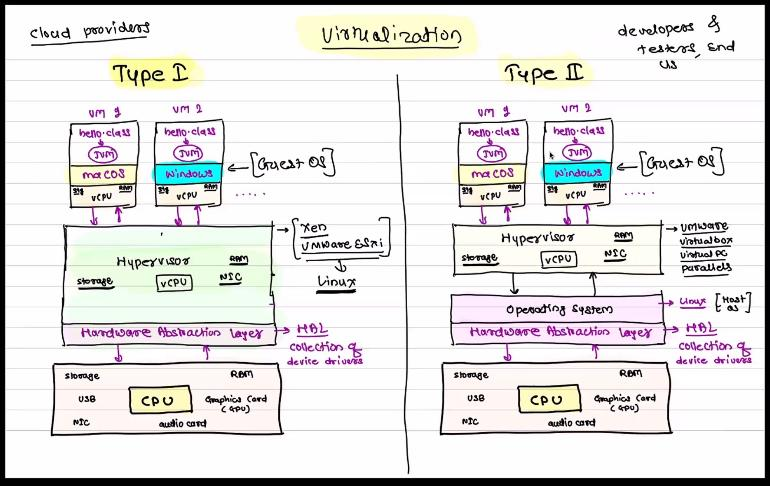

# CLoud COmputing 

## Syllabus 

1.  Introduction to Cloud,
2.  Introduction to 
- Virtualization,
- Containerisation ,
- Cloud Computing,
-  Cloud SPI Model,
-   Cloud Computing Types,
-    Cloud Security,
-   Virtualization, 
-   Hardware Virtualization,
-   Para-Virtualization,
-   Cloning,
-   Snapshot and Template,Containerization,
-   Operating System Virtualization,
-   Cloud architecture,
-   Deployment models,Services provided by Cloud ,
-  Cloud development best practices,
-   Introduction to AWS


--- 

# Day1 

### notes

-  
1. **Desktop computing** 
- The first computer was invented by Charles Babbage (1822) but was not built until 1991! 
  - Alan Turing invented computer science.
  -  The ENIAC (1945) was the first electronic general-purpose digital computer, it filled a room.
  -   The Micral N was the world's first “personal computer”(1973).
- first type of computing(mostly 70's era super computer to desktop )


1. **Client- server computing** 
- 1. second type of computing (in 21 st century came client server ctype computing )
- 2. the internet came into being in 1983 
     - Vinton Cerf and Bob Kahn are credited with inventing the Internet communication protocols we use today and the system referred to as the Internet. 

1. **vertical scaling**  
-  scale up : by increasing server cpu configuration , like cpu processor, ram , storage 

- scale down : decreasing your cpu configuration due to decreased website traffic people visiting 

- issues with vertical scaling 
- 1. dependency on one machine
- 2. limit on single server cpu configuration 

3. **Cluster computing** 
- here we use horizontal scaling,so it is also called **distributed computing** 
- as requested are distributed between multiple machine 
1. **Horizontal scaling** 
- 1. due to issues with vertical scaling , we turn to horizontal scaling
1.we are  cloning server machine containing web server having the website ,this collection is called fleat of machines 
- this is known as CLuster computing 
- 2. here we need to connect fleet of machines to the client,
-  so we add Load Balancer to the cluster for handing request manqagement 
  - it check the free machine , and send the request to the clone  machine which can handle the request
  - example of load balancer :
     - **High Availability Proxy(HA Proxy)**
     - HAProxy is free, open source software that provides a high availability load balancer 
     - and proxy server for TCP and HTTP-based applications that spreads requests across multiple servers. 
     - It is written in C and has a reputation for being fast and efficient
     - using load balancer, we dont need public IP addresses for machines, it's a private address on the same network as the server

- 3. advantage of horizontal scaling  compared to vertical scaling : 
     - no dependency on single machine, comes with increased cost 
     - HIGH- AVAILABILITY 
        - even some clone machine fails, still website is working 

- 4. scaling out :adding more machines, increase in web request
- 5. scaling in : removing th machine , as decrease in web request


- 6. challenges with horizontal /distributed scaling
- need to physically adding machine. needed time for it , 
      - so problem not solved in real time 
- so to solve this , cloud computing was introduced


- 3. **scaling  and  problem with scaling  in client server computing** 
  
> https://www.geeksforgeeks.org/overview-of-scaling-vertical-and-horizontal-scaling/


4. **Cloud Computing**
-  
1. resources
- ppt on cloud
> https://www.journaldev.com/25061/cloud-computing

2. notes 
- 
1.  here the cluster/ fleat of machine are virtual machine server, and not physical server machine, based in a data center
2. in data center,
- 1.  there are server racks,
   -  where multiple  servers are located, with computing power, its located in one rack of server rack,so that rack is called rack server 
   -   with hard drive for storage ,where each HD has 128TB of SSD
   -   GPU + CPU + SSD + physical CPU  : these are componenet of Server rack

- 2. multiple server racks makeas a dat center 


5. **Virtualization** 
-

1.  act of creating a vitual version of something like virutal hardware platform,storage devices and computer network resources
- mostly virtual OS like linux,mac os,windows 
   - two type of hardware virtualization: 
   - 1. type I
   - 2. TYPE II
   - Containerization 


2.  as we needed to test application like java, on multiple os, like windows ,mac os, and linux 
- it was time consuming switching between OS, so virtualisation came into picture



1. TYPE II
+ 
1. Hardware
   - have CPU,NIC,GPU,Storage
2.  HAL (Hardware abstraction layer)
- collection of device driver
3. OS called Host OS
4. Hypervisor 
- convert physical version to virtual one
   - like virtual cpu (vcpu), ram, storage, NIC,
1. now on this hypervisor,
   -  we have virtual machine , here we can install an OS ,called guest OS
2. example of Hypervisor : 
   - virtual box
   - VMWare
   - vitual pc 
   - parallels 
3. for high PC hardware configuration, go for virtual OS, 
   - for lesser configuration ,use multi booting

4. Type I ,practical use 
-
1. easy to install and use , for personal computer,
  -  but we  cant use maximum configuration , due to physical OS on machine for UI , etc occupying resources  
2. best suited for developers,tester,and user   

---

5. TYPE I 
+
1. almost fullest configuration can be used here , as no physical OS i.e host OS om PC machine 
- here, they are customized OS, for virtualizing certian hardware ,and not include UI 
2. example of type I :

- 1. Xen 
    - Xen is an open-source type-1 or baremetal hypervisor,
    -  which makes it possible to run many instances of an operating system or indeed different operating systems in parallel on a single machine (or host).
 
- 2. VMWare esxi
    - VMware ESXi are hypervisors that use software to abstract
    -  processor, memory, storage and networking resources into multiple virtual machines (VMs).
    -   Each virtual machine runs its own operating system and applications.
  
3. best suited for cloud providers


# Day2 

1. to connect to ec2 instance

```bash
 > chmod 400 webserver.pem

> ssh -i webserver.pem ubantu@34.239.106.128

```
2.  after ec2 instance get connected, for single html page
```bash 
       sudo apt-get update
    2  sudo apt-get install apache2
    3  cd /var/www/html/
    4  sudo rm index.html
    5  sudo vim index.html
    6  history
    7 exit  


```


3. to deploy a angular application 
-
1. to connect to ec2 instance

```bash
 > chmod 400 webserver.pem

> ssh -i webserver.pem ubantu@34.239.106.128

```
2.  after ec2 instance get connected, 
```bash 
       sudo apt-get update
    2  sudo apt-get install mysql-server mysql-client
       
       sudo mysql

        alter user 'root'@'localhost' identified with mysql_native_password by 'manager';
Query OK, 0 rows affected (0.00 sec)

mysql> flush privileges;
Query OK, 0 rows affected (0.00 sec)

mysql> exit


sudo mysql -u root -p

create database sunbeam;


mysql> create table movie(movieId integer auto_increment primary key,name varchar(25),rating integer,description varchar(50),image varchar(150));
Query OK, 0 rows affected (0.01 sec)

mysql> exit

sudo apt-get install apache2

  service apache2 status

sudo apt-get install nodejs

sudo apt-get install unzip


packet_write_wait: Connection to 18.208.144.123 port 22: Broken pipe


-- make server folder a zip file 

 scp -i /home/sunbeam/dac/DevOps/Devops-module/Classwork/aws/suraj-aws.pem AMAZON-SERVER.zip ubuntu@18.208.144.123:~/
AMAZON-SERVER.zip  


```